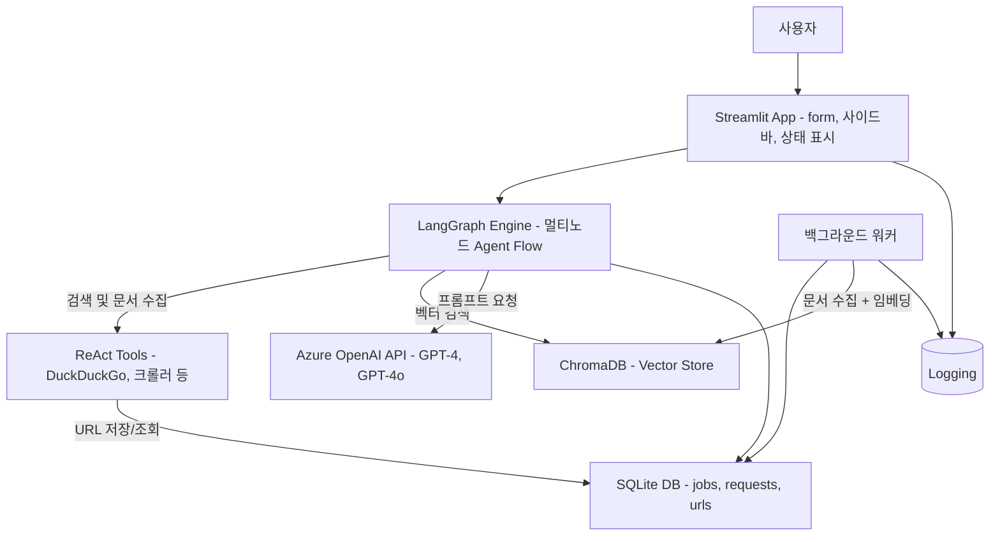
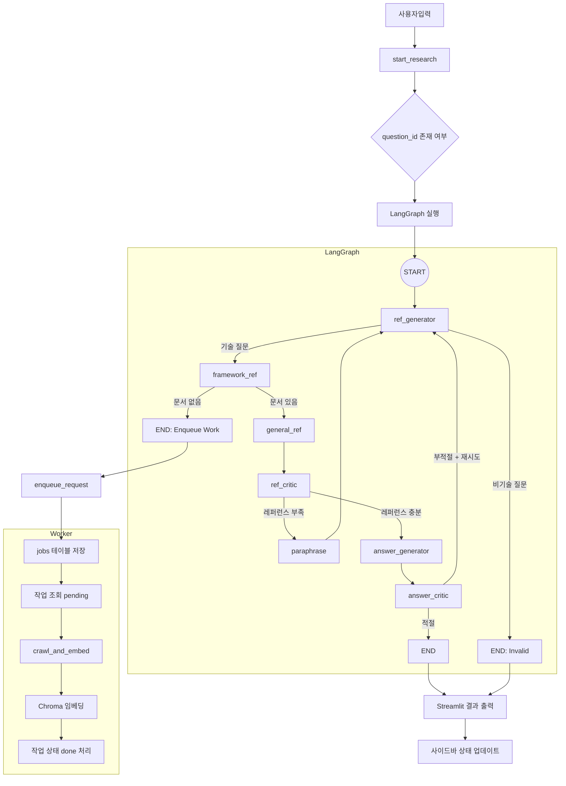

# 공식 문서 마스터

## 개요
- 개발 기간 : 2025.05 - 2025.05 (3주)
- 해결하고자 하는 문제 : 공식 문서를 기반으로 신뢰도 높은 자동 응답을 제공하여 사용자 만족도를 높이는 것을 목표로 함

 

## 핵심 기능

1.  **프레임워크 추론 및 문서 자동 식별**

    *   사용자의 질문에서 **관련 프레임워크 및 기술 키워드**를 추론하고, 해당 기술의 **공식 문서 URL을 자동 탐색**
    *   필요 시 프레임워크 문서를 **백그라운드에서 자동 크롤링 및 임베딩**

2.  **RAG 기반 답변 생성**

    *   질문과 관련된 공식 문서 내용을 벡터 검색하여, **정확하고 신뢰도 높은 문서 기반 응답 생성**

3.  **자동 재질문(paraphrasing) 및 품질 평가**

    *   문서의 관련도가 낮을 경우 **질문을 자동으로 변형(paraphrase)** 하여 재검색 수행
    *   생성된 레퍼런스 및 답변의 **품질을 자체적으로 평가**하여 재시도 또는 종료 여부 결정

4.  **비동기 작업 큐 기반 문서 수집**

    *   임베딩되지 않은 프레임워크의 경우, **백그라운드 큐에 등록 후 별도 워커가 처리**
    *   진행 상태를 사이드바 UI에서 확인 가능

5.  **관리자 수동 개입 및 프레임워크 문서 관리 도구 제공**

    *   URL 캐싱/수정/검증을 위한 **수동 관리 CLI** 및 향후 확장 가능한 UI 제공 구조 설계

 

## 기술 구성
**1) Prompt Engineering**

*   역할 부여하기
*   형식 기법

**2) Azure OpenAI 활용**

*   Tool Calling
*   LangGraph

**3) RAG (Retrieval-Augmented Generation)**

*   RecursiveCharacterTextSplitter
*   Chroma 벡터스토어
*   유사도 점수 임계값 검색

**4) Streamlit**

 

## 서비스 아키텍처

| **컴포넌트**         | **설명**                                        |
| ---------------- | --------------------------------------------- |
| **Streamlit**    | 사용자 질문 입력, 결과 출력 UI                           |
| **LangGraph**    | Agent 흐름 제어 (ref_generator → answer_critic 등) |
| **ReAct Tools**  | 공식문서 URL 탐색, 키워드 기반 문서 수집                     |
| **Chroma**       | 문서 벡터 임베딩 저장소                                 |
| **SQLite**       | 큐 관리 (jobs/requests), URL 캐시                  |
| **Worker**       | 백그라운드 문서 크롤링 및 임베딩 작업 수행                      |
| **Azure OpenAI** | LLM 질의 응답 처리                                  |
| **Logging**      | Streamlit/Worker 공통 로그 저장                     |

 

## 사용자 flow 다이어그램

1.  **Streamlit UI**

    *   사용자가 질문을 제출하면 start_research가 실행되고, LangGraph 상태 머신이 시작

2.  **LangGraph 상태 머신**

    *   ref_generator가 질문 유형을 판별
    *   공식 문서 확인 → framework_ref → general_ref 순으로 레퍼런스를 수집·평가하며, 부족하면 paraphrase로 돌아가 재검색을 시도
    *   답변이 생성된 뒤 answer_critic가 품질을 검증하고, 통과(Y)하면 종료, 실패(N)하면 루프를 반복

3.  **큐 & 워커**

    *   framework_ref 단계에서 공식 문서가 없으면 (ENQUEUE_WORK) 경로를 통해 **jobs** 테이블에 작업을 등록하고 즉시 답변 대신 대기 안내를 반환
    *   별도 **Worker** 프로세스가 pending 상태의 잡을 선택해 문서를 크롤링·임베딩한 뒤 상태를 done으로 업데이트

4.  **결과 반환 및 UI 업데이트**

    *   LangGraph가 END에 도달하면 Streamlit에 최종 답변 또는 오류 메시지를 출력하고, 사이드바 뱃지로 진행 상황을 표시

 

## DB ERD

